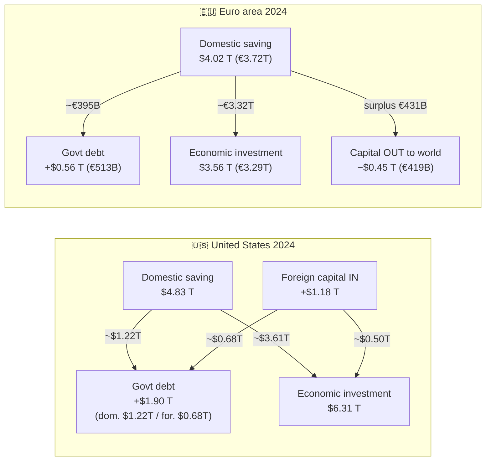

# Savings → Government Debt → Economic Development: US vs Europe

**A "follow the money" analysis of where domestic savings go and how government borrowing is financed.**

- **Geography:** "Europe" = **euro area (EA20)** (cleanest geography for consolidated government-debt holder data; EU27 figures noted where useful). United States = federal / total-economy.
- **Years:** **2023 and 2024** (latest years with finalized data).
- **Units:** absolute **USD** (primary). Euro-area source data is in EUR, converted at the **ECB annual-average EUR/USD rate: 1.0813 (2023), 1.0824 (2024)**.
- **Compiled:** June 2026, from primary sources (BEA, US Treasury, Federal Reserve, Eurostat, ECB, Bundesbank, World Bank). Full source list at the end.

---

## ⭐ The simple result

### 2024 (USD)

| # | Flow (per year) | 🇺🇸 United States | 🇪🇺 Euro area (EA20) |
|---|---|---:|---:|
| **1a** | **Govt debt increase** (annual) | **+$1.90 T** | **+$0.56 T** (€513 B) |
| **1b** | — financed **domestically** | ~$1.22 T (**~64%**) | structurally ~77% of stock |
| **1c** | — financed by **foreigners** | ~$0.68 T (**~36%**) | 2024 flow ~$0.50 T (€461 B)* |
| **2** | **Gross domestic saving** (the pool) | **$4.83 T** | **$4.02 T** (€3.72 T) |
| 2b | — of which households | $1.19 T | $1.55 T (€1.43 T) |
| **3a** | Saving → **government debt** (domestic part) | ~$1.22 T (**~25% of saving**) | ~$0.43 T (**~11%**) |
| **3b** | Saving → **economic development** (investment) | ~$3.61 T | ~$3.59 T (€3.32 T) |
| **3c** | **Foreign capital contribution** (net) | **+$1.18 T inflow** (CA deficit) | **−$0.45 T outflow** (CA surplus) |
| ref | Gross capital formation (total investment) | $6.31 T | $3.56 T (€3.29 T) |
| ref | Foreign share of total govt-debt **stock** | ~30% | ~23% |

### 2023 (USD)

| # | Flow (per year) | 🇺🇸 United States | 🇪🇺 Euro area (EA20) |
|---|---|---:|---:|
| **1a** | Govt debt increase (annual) | +$1.70 T (FY deficit) | +€513 B / $555 B |
| **2** | Gross domestic saving | $4.74 T | $3.85 T (€3.56 T) |
| 2b | — of which households | $1.16 T | $1.39 T (€1.29 T) |
| **3b** | Saving → economic development (investment) | ~$3.6 T | ~$3.56 T (€3.29 T GCF) |
| **3c** | Foreign capital contribution (net) | +$0.94 T inflow (CA deficit) | −$0.26 T outflow (CA surplus) |
| ref | Foreign net purchases of govt debt | +$0.68 T (Treasuries) | +$0.43 T (€398 B) |

\* **Europe 1b/1c caveat:** structurally ~77% of euro-area government debt is held *within* the euro area ("domestic"), ~23% by the rest of the world. But the **2024 *flow* was foreign-dominated** because the Eurosystem (a domestic holder) was in quantitative tightening — see narrative below.

---

## The one-line contrast

> **The US doesn't save enough to fund both its government and its economy, so it imports ~$1.2 trillion of foreign capital every year. Europe saves more than it invests, funds its own government, and still exports ~$0.45 trillion of capital to the rest of the world** — much of it, ironically, into US Treasuries.

---

## Flow of funds (2024)

---

## 🇺🇸 United States — follow the money (2024)

**1. Government borrowing & who buys it**
- Federal deficit (FY2024): **$1.83 T**; debt held by the public rose **+$1.90 T** (calendar year; +$1.98 T on a fiscal-year basis).
- **Foreign investors absorbed +$679 B (~36%)** of that increase. Foreigners hold **~30% of the $28.8 T public debt** ($8.62 T, Treasury TIC Major Foreign Holders).
- **The Fed was *shrinking* its holdings (QT): −$482 B.** So domestic *private* buyers (banks, money-market & mutual funds, households, pensions) absorbed **~$1.7 T** — both the new issuance *and* the Fed's runoff. Net domestic share of the increase ≈ 64%.

**2. Domestic saving pool**
- Gross national saving: **$4.83 T** (~16.5% of GDP). Personal/household saving: **$1.19 T** (saving rate ~5.4%).

**3. Allocation of saving**
- Government's domestic borrowing claimed **~$1.22 T (~25%)** of the saving pool.
- That leaves **~$3.61 T** for productive investment — but total gross domestic investment was **$6.31 T**.
- The **$1.18 T gap was filled by foreign capital** (= the current-account deficit). Of foreign inflows, ~$679 B went into Treasuries, ~$500 B into private/economic assets.
- **Punchline:** government dissaving (net government saving was **−$2.05 T**) drained net national saving to **~$36 B**, so virtually *all* net US investment now leans on foreign saving.

## 🇪🇺 Euro area — follow the money (2024)

**1. Government borrowing & who buys it**
- Deficit: **€467 B ($505 B)**; gross (Maastricht) debt rose **+€513 B ($555 B)** to €13.26 T (87% of GDP).
- **Structurally, ~77% of euro-area government debt is held domestically** (within the euro area), ~23% by the rest of the world.
- **But in 2024 the marginal buyer was foreign:** with the Eurosystem in QT (its share of euro-area debt fell 30%→27%; total bond holdings −€700 B since mid-2022), **non-residents bought €461 B ($499 B) net** — more than the entire net issuance — while domestic *net* holdings barely rose. So the *stock* is domestic; the *2024 flow* was foreign-dominated because a domestic buyer (the central bank) was retreating.

**2. Domestic saving pool**
- Gross national saving: **€3.72 T / $4.02 T** (~24.4% of GDP — far above the US). Household saving: **€1.43 T / $1.55 T** (saving rate ~15.3%, roughly 3× the US rate).

**3. Allocation of saving**
- Government's domestic share of borrowing claimed **~€395 B / $0.43 T (~11%)** of the pool (structural basis).
- Remaining **~€3.32 T** funds gross capital formation of **€3.29 T ($3.56 T)** — saving covers investment with room to spare.
- The **€431 B excess of saving over investment is exported abroad** (current-account **surplus +€419 B / $453 B**; net lending to rest of world **+€440 B**). Europe is a **net capital exporter**.
- **Punchline:** Europe funds its government *and* its economy *and* sends roughly a half-trillion dollars of surplus saving overseas.

---

## ⚠️ Data caveats (read before quoting the numbers)

1. **Stock vs flow.** Foreign-holding *levels* (TIC, ECB i.i.p.) include price/valuation moves, not pure cash purchases. The debt-increase decompositions mix stock changes with flows — treat the domestic/foreign % as **indicative, not exact cash accounting**.
2. **Europe's "domestic vs foreign" is definitional.** ECB international-investment-position data counts *only outside-the-euro-area* as foreign (intra-euro-area cross-border = "resident"). On a single-country residency basis the foreign share is higher (~26%, Bundesbank). The 2024 *flow* (€461 B foreign) and the *stock* (23% foreign) tell different stories — both are shown.
3. **Gross national saving already nets out government dissaving** (NIPA/ESA convention). The "saving → gov debt vs development" split (row 3) is a flow-of-funds intuition layered on the identity *Investment = Saving + Net foreign borrowing*; it is directionally right but the categories are not strictly additive. The identity reconciles cleanly:
   - US: $6.31 T investment ≈ $4.83 T saving + $1.18 T foreign (+ ~$0.30 T statistical discrepancy).
   - Euro area: €3.29 T investment ≈ €3.72 T saving − €0.43 T exported.
4. **FY vs CY for the US:** the deficit is fiscal-year (ends Sep 30); holder data (TIC) is calendar-year (Dec 31). Public-debt increase is +$1.98 T (FY) vs +$1.90 T (CY); the holder split is anchored to CY for consistency with TIC.
5. **Vintage:** euro-area figures use Eurostat's Oct 2025 second notification; US figures reflect BEA's 2025 comprehensive update (which revised saving up and the 2023 current-account deficit to −$938 B).

---

## Key figures with sources

### United States
| Item | 2023 | 2024 | Source |
|---|---:|---:|---|
| Federal deficit (FY) | $1,695.2 B | $1,832.8 B | Treasury MTS / Fiscal Data |
| Debt held by public, increase (CY) | — | +$1,898.5 B | Treasury Debt to the Penny |
| Debt held by public, level (CY end) | $26,938.5 B | $28,837.0 B | Treasury Debt to the Penny |
| Foreign holdings of Treasuries (Dec) | $7,940.0 B | $8,619.3 B | Treasury TIC (MFH) |
| Foreign share of public debt | 29.5% | 29.9% | TIC / MSPD |
| Change in foreign Treasury holdings | — | +$679.3 B | Treasury TIC |
| Fed SOMA Treasury holdings change | — | −$481.6 B | FRED TREAST |
| Gross national saving | $4,735.3 B | $4,832.5 B | BEA NIPA T5.1 (FRED A929RC1A027NBEA) |
| Personal (household) saving | $1,159.2 B | $1,193.2 B | BEA (FRED W986RC1A027NBEA) |
| Gross domestic investment | $5,999.0 B | $6,308.6 B | BEA NIPA T5.1 (FRED W170RC1A027NBEA) |
| Net government saving | −$1,844.5 B | −$2,053.2 B | BEA (FRED A922RC1A027NBEA) |
| Current-account balance | −$937.8 B | −$1,179.9 B | BEA Intl Transactions (FRED A124RC1A027NBEA) |
| Nominal GDP | $27,811.5 B | $29,298.0 B | BEA (FRED GDPA) |

### Euro area (EA20), EUR
| Item | 2023 | 2024 | Source |
|---|---:|---:|---|
| Govt deficit (net borrowing) | €513.5 B | €466.6 B | Eurostat (2nd notif., Oct 2025) |
| Govt gross debt, level (year end) | €12,750.5 B | €13,263.4 B | Eurostat |
| Govt gross debt, annual change | — | +€512.9 B | Eurostat |
| Non-resident net purchases of govt debt securities | €398 B | €461 B | ECB Economic Bulletin (Jun 2025) |
| Foreign (rest-of-world) share of govt debt stock | ~23% | ~23% | ECB |
| Eurosystem share of govt debt | — | ~27% (peak ~30% mid-2022) | Bundesbank / ECB |
| Gross national saving (S1, B8G) | €3,564.96 B | €3,715.91 B | Eurostat nasa_10_nf_tr |
| Household gross saving (S14_S15) | €1,289.2 B | €1,433.6 B | Eurostat nasa_10_nf_tr |
| Gross capital formation (P5G) | €3,294.7 B | €3,285.1 B | Eurostat nama_10_gdp |
| Current-account balance | +€241 B | +€419 B | ECB balance of payments |
| Net lending to rest of world (B9) | +€297 B | +€440 B | Eurostat / ECB sector accounts |
| Nominal GDP | €14,670.7 B | €15,248.5 B | Eurostat |

### Cross-checks (% of GDP, World Bank WDI)
| | US 2023 | US 2024 | Euro area 2023 | Euro area 2024 |
|---|---:|---:|---:|---:|
| Gross national savings | 17.7% | 17.8% | 24.7% | 24.5% |
| Gross capital formation | 21.9% | 21.8% | 22.4% | 21.5% |

### EUR/USD annual average (ECB)
- 2023: **1.0813** USD per EUR
- 2024: **1.0824** USD per EUR

---

## Source links
- US debt & holders: [Treasury Fiscal Data](https://fiscaldata.treasury.gov/), [Treasury TIC Major Foreign Holders](https://ticdata.treasury.gov/Publish/mfhhis01.txt), [FRED SOMA Treasury holdings (TREAST)](https://fred.stlouisfed.org/series/TREAST), [GAO Schedules of Federal Debt](https://www.gao.gov/products/gao-25-107138)
- US saving & investment: [BEA NIPA Table 5.1 (gross saving)](https://fred.stlouisfed.org/series/A929RC1A027NBEA), [gross domestic investment](https://fred.stlouisfed.org/series/W170RC1A027NBEA), [net government saving](https://fred.stlouisfed.org/series/A922RC1A027NBEA), [current account](https://fred.stlouisfed.org/series/A124RC1A027NBEA), [BEA International Transactions 2024](https://www.bea.gov/news/2025/us-international-transactions-4th-quarter-and-year-2024)
- Euro-area debt & holders: [Eurostat deficit/debt notification (Oct 2025)](https://ec.europa.eu/eurostat/web/products-euro-indicators/w/2-21102025-ap), [ECB "Geopolitics and foreign holdings of euro area government debt" (Jun 2025)](https://www.ecb.europa.eu/press/other-publications/ire/article/html/ecb.ireart202506_01~a8b7241329.en.html), [Bundesbank creditor-structure report (Apr 2024)](https://publikationen.bundesbank.de/publikationen-en/reports-studies/monthly-reports/government-debt-in-the-euro-area-current-developments-in-creditor-structure--929590), [ECB QT blog (Nov 2024)](https://www.ecb.europa.eu/press/blog/date/2024/html/ecb.blog241114~6a3182c0bd.en.html)
- Euro-area saving & investment: [Eurostat sector accounts (nasa_10_nf_tr)](https://ec.europa.eu/eurostat/databrowser/view/nasa_10_nf_tr), [Eurostat GDP (nama_10_gdp)](https://ec.europa.eu/eurostat/databrowser/view/nama_10_gdp), [ECB balance of payments (Dec 2024)](https://www.ecb.europa.eu/press/stats/bop/2025/html/ecb.bp250219~1b7c22208f.en.html), [ECB sector accounts Q4 2024](https://www.ecb.europa.eu/press/stats/ffi/html/ecb.eaefd_full2024q4~5662d9f0c9.en.html)
- FX & cross-checks: [ECB EUR/USD reference rate](https://data.ecb.europa.eu/data/datasets/EXR/EXR.A.USD.EUR.SP00.A), [World Bank gross savings %GDP](https://data.worldbank.org/indicator/NY.GNS.ICTR.ZS), [World Bank gross capital formation %GDP](https://data.worldbank.org/indicator/NE.GDI.TOTL.ZS)
